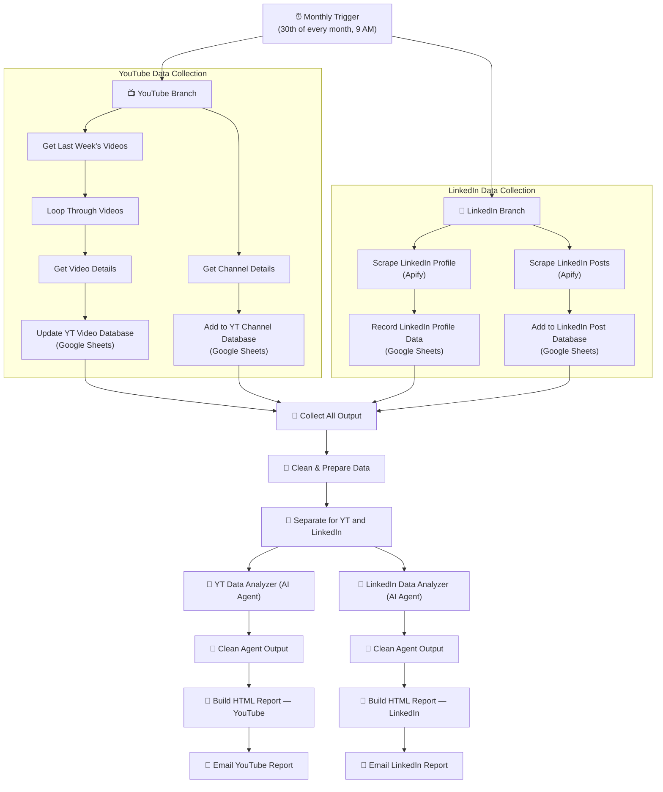

# 🧑‍💼 AI Employee — YouTube & LinkedIn Analytics Reporter

**A self-running "employee" that pulls your YouTube channel and LinkedIn profile stats every month, has an AI analyst write up the insights, and emails you a polished HTML report — automatically.**

Built with [n8n](https://n8n.io/), the YouTube Data API, [Apify](https://apify.com/) (LinkedIn scraping), OpenAI, Google Sheets, and Gmail.

[](https://n8n.io/)
[]()
[]()

> 📄 This repo includes the **actual n8n workflow export** (sanitized — personal email, real Google Sheet ID, and a real LinkedIn profile URL used during testing have all been replaced with placeholders). Import it into your own n8n instance, plug in your own credentials, and it's ready to run.

---

## 📌 The Problem

Tracking your own channel or profile performance month over month means:

- Logging into YouTube Studio and LinkedIn separately
- Manually noting down views, subscribers, likes, and engagement
- Trying to remember what changed since last month
- Usually... just not doing it consistently

For anyone building a personal brand, posting consistently and never reviewing the data is a missed feedback loop.

## 💡 The Solution

Once a month (the 30th, automatically), this system:

1. **Pulls YouTube data** — channel stats (subscribers, views, video count) and details for every video published in the last week
2. **Pulls LinkedIn data** — profile stats and the last month's posts, via Apify scrapers (no LinkedIn API needed)
3. **Logs everything to Google Sheets** — a running history of channel and profile performance over time
4. **Sends the data to two AI analyst agents** — one for YouTube, one for LinkedIn — which calculate engagement scores, rank performance, and write up structured insights
5. **Builds a styled HTML report** for each platform
6. **Emails both reports** straight to your inbox

No dashboards to check, no manual data pulling — the reports just show up.

---

## 🏗️ Architecture



<p align="center">
  
  <br><em>n8n canvas — YouTube branch, LinkedIn branch, AI analysis, and report delivery</em>
</p>

---

## 🔄 Step-by-Step Flow

| Step | What Happens |
|---|---|
| 1. Monthly Trigger | Fires automatically on the 30th of every month at 9 AM |
| 2. YouTube — Channel Details | Pulls subscriber count, total views, video count, and channel creation date |
| 3. YouTube — Recent Videos | Fetches every video published in the last 7 days and loops through each to get full video details (views, likes, comments) |
| 4. YouTube — Log to Sheets | Channel and video stats are written to two Google Sheets databases for historical tracking |
| 5. LinkedIn — Profile Scrape | An Apify actor scrapes profile stats: followers, connections, location |
| 6. LinkedIn — Post Scrape | A second Apify actor scrapes the last month's posts: likes, comments, content type, posting day/hour |
| 7. LinkedIn — Log to Sheets | Profile and post data are written to Google Sheets for historical tracking |
| 8. Merge & Clean | YouTube and LinkedIn data streams are merged, cleaned, and split back into two separate payloads |
| 9. AI Analysis | Two separate AI Agents (YouTube analyst, LinkedIn analyst) compute engagement scores, rank post/video performance, and generate structured insights |
| 10. Report Generation | Each agent's output is converted into a styled HTML report |
| 11. Email Delivery | The YouTube report and LinkedIn report are sent as two separate emails |

---

## 📊 Sample Output

<p align="center">
  
  <br><em>Sample monthly YouTube Channel Analysis Report — channel overview, age, subscriber/view totals</em>
</p>

<p align="center">
  
  <br><em>Sample LinkedIn Profile Analytics Report — followers, connections, and per-post engagement breakdown</em>
</p>

> Both samples are real output from a live run (profile/channel IDs blurred for privacy).

---

## 🧰 Tech Stack

| Tool | Role in the System |
|---|---|
| **n8n** | Orchestration engine — scheduling, branching, looping, merging |
| **YouTube Data API** | Channel details and video-level statistics |
| **Apify** | Scrapes LinkedIn profile stats and post performance (no official LinkedIn API needed) |
| **Google Sheets** | Historical database for both YouTube and LinkedIn metrics over time |
| **OpenAI (via n8n LangChain Agent nodes)** | Two dedicated AI analyst agents — one per platform — that turn raw metrics into written insights |
| **Gmail** | Delivers the finished HTML reports straight to the inbox |

---

## 📁 Repo Structure

```
.
├── README.md                                       → you are here
├── docs/
│   └── WORKFLOW_OVERVIEW.md                        → detailed node-by-node breakdown
├── workflows/
│   └── AI_Employee_YouTube_LinkedIn_Analysis.json   → main n8n workflow (import directly into n8n)
└── assets/
    ├── workflow-canvas.png
    ├── youtube-report-sample.png
    └── linkedin-report-sample.png
```

---

## ⚙️ Setting It Up Yourself

1. Import `workflows/AI_Employee_YouTube_LinkedIn_Analysis.json` into your n8n instance
2. Create credentials for:
   - **YouTube (OAuth2)** — for channel/video data
   - **Apify** — for the two LinkedIn scraper actors
   - **Google Sheets (OAuth2)** — for the four tracking databases
   - **OpenAI** — for the two analyst agents
   - **Gmail (OAuth2)** — for report delivery
3. Run the included **"Get YouTube Channel ID"** sub-flow once (manual trigger) to fetch your channel ID, then paste it into the `Enter Channel ID` nodes
4. Swap the placeholder LinkedIn profile URL in the two Apify nodes for your own profile
5. Point the four Google Sheets nodes at your own spreadsheet (a sheet ID placeholder is included — create your own sheet with matching tabs)
6. Update the Gmail nodes' recipient address to your own inbox
7. Activate the workflow

> All personal email addresses, the original Google Sheet ID, and the LinkedIn profile URL used during testing have been replaced with placeholders in this export.

---

## 🎯 Who This Is Built For

- Creators and founders who post on YouTube and/or LinkedIn and want a consistent monthly performance review without doing it manually
- Anyone who wants a historical, queryable log of their own content performance (via the Google Sheets databases) rather than relying on platform-native dashboards
- A reusable template for building "AI employee" style reporting automations for any other data source

---

## 📬 About / Contact

Built by **VIRSpace AI** — automation systems for sales, marketing, and personal-brand operations.

- 🌐 [virspaceai.com](https://virspaceai.com/)
- 📧 viraj.bhapkar@virspaceai.com
- 📱 +91 99871 42405

> The workflow export in this repo has had personal email addresses, the original Google Sheet ID, and a real LinkedIn profile URL used during testing replaced with placeholders. Shared as a working reference implementation, not a hosted/managed product.
